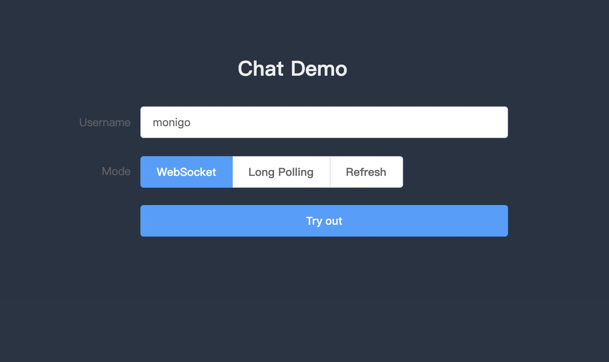
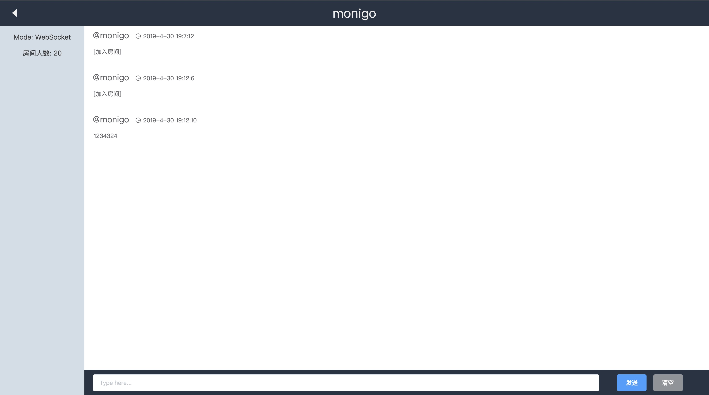

    

<h1 align=center>Chat</h1>

## Description

golang实现的聊天室

其中实现三种方式

- 刷新-refresh
- 长轮询-longpolling
- 长连接-websocket

## 更新日志

### 2019.4.30

- 更新UI
- 优化接口

### 2018.12.19

- 优化聊天室逻辑

## 效果图

### 主页

### 聊天室

## Thanks To

- [gin](https://github.com/gin-gonic/gin)
- [gorilla/websocket](https://github.com/gorilla/websocket)
- [vuejs](https://github.com/vuejs/vue)
- [element](https://github.com/ElemeFE/element)
- [axios](https://github.com/axios/axios)
- [js-cookie](https://github.com/js-cookie/js-cookie)

## Donate

如果觉得这个项目帮助到您，可以考虑请作者一包辣条或一杯咖啡 😄 
